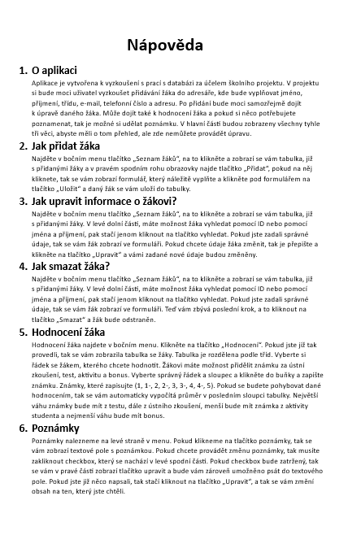

##### Projekt do: 9.5.2023
###### Autor: Martin Rumíšek

# Školní projekt OAUH 2023 - GUI JAVA
### Zadání k projektu:
Projekt bude tvořen v Intellij Idea. Aplikace bude zobrazovat seznam žáku. Na každého žáka budou zobrazeny informace, které budou načteny do databáze. Hlavním tématem tohohle projektu bude, naučit se pracovat s databází. Mělo by být umožněno přidávání žáku, editace současných dat, zobrazení a také smazání dat. Data budou zobrazeny v tabulce.

**Přidání dat:**

- Bude umožněno přidání nového žáka, pomocí formuláře, do kterého uživatel vyplní všechny možné informace, např. jméno, příjmení, telefonní číslo, email, bydliště atd.

**Editace dat**

- Po zobrazení dat v tabulce, bude mít uživatel možnost dvojklikem otevřít formulář, se zadaným žákem. Formulář bude ale vyplněn a uživatel data může přepsat a změnit.

**Zobrazení dat**

- Přidané data budou vloženy do databáze a odtud budou data vypsány do tabulky, kde všechny informace uživatel bude moci vidět.

**Smazání dat**

- Uživatel bude moci data také odstranit, aby se odstranili s databáze a nebyli již zobrazovány.

## Jak by měl projekt vypadat?
- Aplikace je rozdělena na boční menu se středovým obsahem. Nahoře je vlastní lišta pro minimalizování okna + zavření okna (ukončení aplikace).
- Při spuštění aplikace, by se nám měl zobrazit souhrn výpisu z adresáře + hodnocení žáků + vlastních poznámek.
- Boční menu nám bude sloužit pro výběr dané kategorie, které chceme upravovat.

### Úvodní stránka
- Souhrn všech výpisů, které jsou v aplikaci možné. Je to možnost vidět všechno pohromadě.

### Seznam žáků
- Tahle sekce by měla zobrazovat takový menší adresář, do kterého bychom měli zapisovat žáky.
- Zde je možnost přidávání
- Vyhledání žáka
- Pokud žáka vyhledáme, tak můžeme upravit informace o žákovi, nebo také žáka odstranit.

### Hodnocení
- Hodnocení je rozdělené podle tříd, takže žáky máme rozdělené.
- Jsou vyobrazeny v tabulce. Z adresáře jsou zapsány údaje: (jméno a příjmení + třída).
- Do prázdných buňek máme možnost zapisovat známky ve stupnici (1, 1-, 2, 2-, 3, 3-, 4, 4-, 5). Pokud bychom dodrželi tohle pravidlo, tak se nám vždy u žáka spočítá průměr jeho známek. Největší váhu známky má test, dále ústní zkoušení, menší váhu aktivita + bonus.

### Poznámky
- Zde si můžeme vypsat libovolný text, který si můžeme uložit.

## Nápověda pro aplikaci

######  Zadání k projektu je v rozpracované verzi
###### poslední úprava: 8.5.2023
